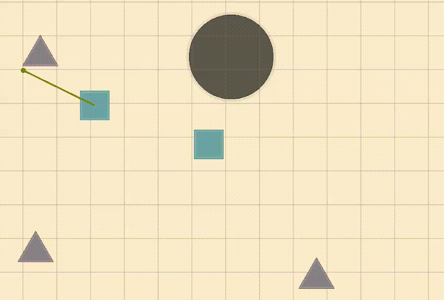

## HEXICAL

### Description

Hexical is a tiny arcade game about merging geometric figures to higher your score. It was solo developed for the raylib game jam in 6 days  .

### Features

 - Simple art style 100% made with raylib
 - Random generation for infinite replayability
 - Played in browser and mobile friendly

### Controls

Keyboard:
 - Left Click + Drag: Aim the shape
 - Release Left Click: Shoot the shape
 - Right Click + Aiming: Cancel shot

### Screenshots

### Developer

 - Marcos Matutes Rapun

### Links

 - itch.io Release: https://malkoom.itch.io/hexical

### License

This project sources are licensed under an unmodified zlib/libpng license, which is an OSI-certified, BSD-like license that allows static linking with closed source software. Check [LICENSE](LICENSE) for further details.

*Copyright (c) 2026 Marcos Matutes (@malkoom)*
